# banking

The service of "banking" operations. There are users (clients) in the system, each client has strictly one "money account", which initially contains some amount. Money can be transferred between clients. Interest is also accrued on the funds. The user can add/change their phone number and/or email if they are not already occupied by other users. The user can delete their phone and/or email. However, you cannot delete the last one.

## Stack
- Java 17
- Spring
- JWT
- MapStruct
- Lombok
- PostgreSQL

# API

## Authorization

### `POST` /auth/register

Creates new user and money account

**Request body:**
- `username` - username
- `password` - user password
- `confirmPassword` - password confirmation
- `phoneNumber` - user phone number
- `email` - user email
- `birthDay` - user birth day
- `name` - user last name, first name, patronymic
- `balance` - user money account balance

**Example:**

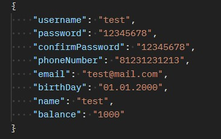

**Response body:**
- `username` - username
- `password` - user password
- `birthDay` - user birth day
- `name` - user last name, first name, patronymic
- `emails` - user emails
- `phoneNumbers` - user phone numbers
- `moneyAccount` - user money account

**Example:**

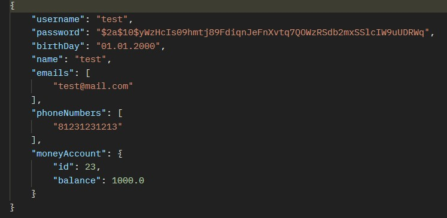

**Exception:**
- using an existing username - `User 'username' already exists.`
- using a too short or too long username - `Username length must be at least 2 and smaller than 50 symbols.`
- using the wrong password to confirm - `Password don't match.`
- using a short password - `Password must be at least 8 characters long.`
- using an existing phone number - `Phone number already exists.`
- using wrong format of the phone number - `Phone number does not match the format: 8XXXXXXXXXX.`
- using an existing email - `Email address already exists.`
- using invalid email - `Enter a valid email address.`
- balance is less than 1 - `Balance must be greater than 0.`

### `POST` /auth/login

Authenticates user and returns authorization token

**Request body:**
- `username` - username
- `password` - user password

**Example:**

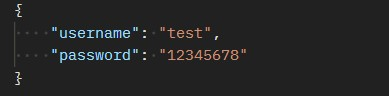

**Response body:**
- `token` - authorization token

**Example:**

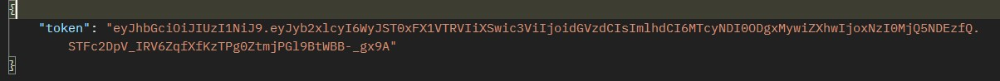

**Exception:**
- using wrong username or password - `Invalid username or password.`

## Profile

### `GET` /profile/{username}

Returns user `{username}`

**Response body:**
- `username` - username
- `password` - user password
- `birthDay` - user birth day
- `name` - user last name, first name, patronymic
- `emails` - user emails
- `phoneNumbers` - user phone numbers
- `moneyAccount` - user money account

**Example:**

**Exception:**
- using an invalid token - `Unauthorized.` 401 Unauthorized
- using someone else token - `Unauthorized.` 403 Forbbiden

### `POST` /profile/{username}/emails

Adds new email to the user `{username}`

**Request body:**
- `email` - new user email

**Example:**

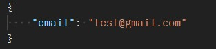

**Response body:**
- `username` - username
- `password` - user password
- `birthDay` - user birth day
- `name` - user last name, first name, patronymic
- `emails` - user emails
- `phoneNumbers` - user phone numbers
- `moneyAccount` - user money account

**Example:**

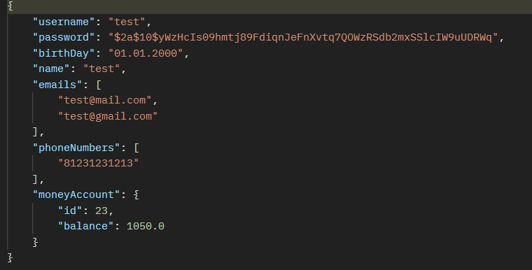

**Exception:**
- using an invalid token - `Unauthorized.` 401 Unauthorized
- using someone else token - `Unauthorized.` 403 Forbbiden
- using an existing email - `Email address already exists.`
- using invalid email - `Enter a valid email address.`

### `DELETE` /profile/{username}/emails

Deletes email to the user `{username}`

**Request body:**
- `email` - to be deleted user email

**Example:**

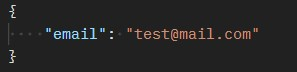

**Response body:**
- `username` - username
- `password` - user password
- `birthDay` - user birth day
- `name` - user last name, first name, patronymic
- `emails` - user emails
- `phoneNumbers` - user phone numbers
- `moneyAccount` - user money account

**Example:**

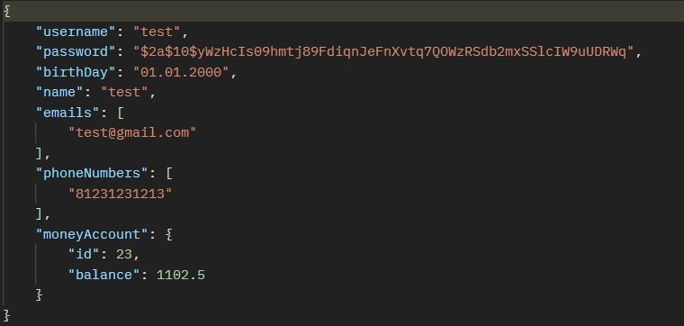

**Exception:**
- using an invalid token - `Unauthorized.` 401 Unauthorized
- using someone else token - `Unauthorized.` 403 Forbbiden
- deleting not exist email - `Email not found.`
- deleting the last email - `Must be at least one email address.`

### `POST` /profile/{username}/phone-numbers

Adds new phone number to the user `{username}`

**Request body:**
- `phoneNumber` - new user phone number

**Example:**

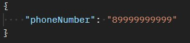

**Response body:**
- `username` - username
- `password` - user password
- `birthDay` - user birth day
- `name` - user last name, first name, patronymic
- `emails` - user emails
- `phoneNumbers` - user phone numbers
- `moneyAccount` - user money account

**Example:**

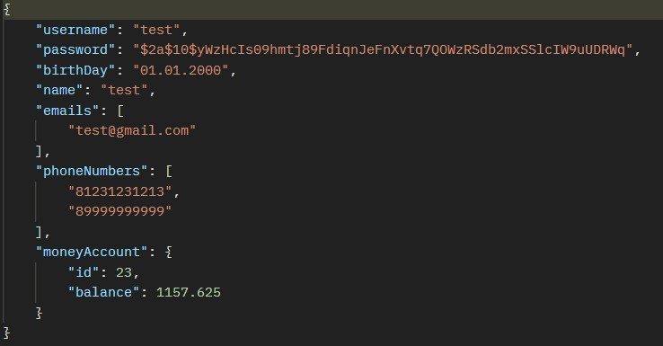

**Exception**
- using an invalid token - `Unauthorized.` 401 Unauthorized
- using someone else token - `Unauthorized.` 403 Forbbiden
- using an existing phone number - `Phone number already exists.`
- using wrong format of the phone number - `Phone number does not match the format: 8XXXXXXXXXX.`

### `DELETE` /profile/{username}/phone-numbers

Deletes phone number to the user `{username}`

**Request body:**
- `phoneNumber` - to be deleted user phone number

**Example:**

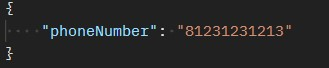

**Response body:**
- `username` - username
- `password` - user password
- `birthDay` - user birth day
- `name` - user last name, first name, patronymic
- `emails` - user emails
- `phoneNumbers` - user phone numbers
- `moneyAccount` - user money account

**Example:**

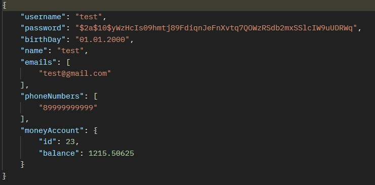

**Exception**
- using an invalid token - `Unauthorized.` 401 Unauthorized
- using someone else token - `Unauthorized.` 403 Forbbiden
- deleting not exist phone number - `Phone number not found.`
- deleting the last phone number - `Must be at least one phone number.` 

## Payment

### `GET` /payment/{username}

Returns all payment user `{username}`

**Response body:**
- `id` - payment id
- `amount` - payment amount
- `senderMoneyAccountId` - id sender money account
- `recipientMoneyAccountId` - id recipient money account
- `paymentDate` - date and time of payment 

**Example:**

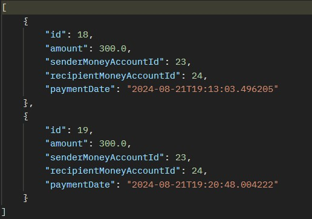

**Exception**
- using an invalid token - `Unauthorized.` 401 Unauthorized
- using someone else token - `Unauthorized.` 403 Forbbiden

### `POST` /payment/{username}

Transfers "money" from the user `{username}` money account to the money account with id `recipientMoneyAccountId` 

**Request body:**
- `amount` - amount that the user wants to transfer
- `recipientMoneyAccountId` - id recipient money account

**Example:**

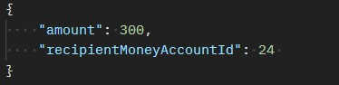

**Response body:**
- `id` - payment id
- `amount` - payment amount
- `senderMoneyAccountId` - id sender money account
- `recipientMoneyAccountId` - id recipient money account
- `paymentDate` - date and time of payment 

**Example:**

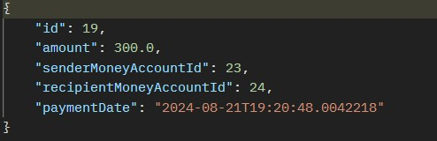

**Exception**
- using an invalid token - `Unauthorized.` 401 Unauthorized
- using someone else token - `Unauthorized.` 403 Forbbiden
- transfering less than 1 - `Amount must be greater than 0.`
- transfering on the not existing money account - `Money account not found.`